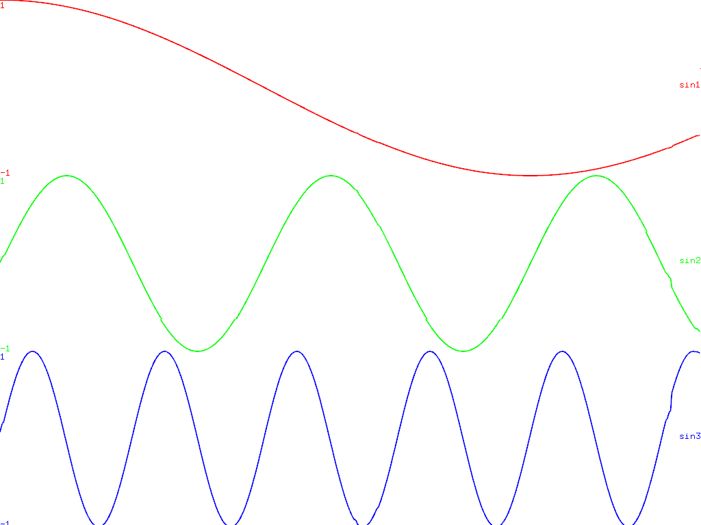

ofxPlotter
==========

Introduction
------------
A simple function plotter class for openFrameworks with built-in variable filtering and a ascetic syntax.

Requirements
------------
It requires C++11 so it will work on any oF distribution past 0.9. Should work on all the major OSes (Windows, OSX, Linux, Android, iOS), no special requirements here.

Usage
-----
ofxPlotter is designed to be as simple and as minimal as possible for plotting functions in realtime.
    
    plotter["myData"].setPlotLength(240);            // set the number of values to be stored
    plotter["myData"].setColor( ofColor(255,0,0) );  // set the color of the plot
    plotter["myData"].setMinMaxValue( 0.f, 1024.f ); // set the min and max values
    plotter["myData"].drawGuidelines = false; 
    plotter["myData"].drawInfo = false;
    plotter["myData"].drawOverlay = false; 
    
    plotter["myData"].setCurrentValue( variable ); // add a new data to the plot "variable name". Takes int and float
    
    plotter.drawPlot("myData", 100, 100, 300, 300); // draw a single plot. x,y,width,height
    
    plotter.drawAll(); // Every _variable name_'s plot will be drawn using the whole screen

### License

ofxPlotter
Copyright (C) 2017-2019 Juan Carlos Carvajal Bermudez
Based on the plugin by zebra

This program is free software: you can redistribute it and/or modify
it under the terms of the GNU General Public License as published by
the Free Software Foundation, either version 3 of the License, or
any later version.

This program is distributed in the hope that it will be useful,
but WITHOUT ANY WARRANTY; without even the implied warranty of
MERCHANTABILITY or FITNESS FOR A PARTICULAR PURPOSE.  See the
GNU General Public License for more details.

You should have received a copy of the GNU General Public License
along with this program.  If not, see <https://www.gnu.org/licenses/>.

